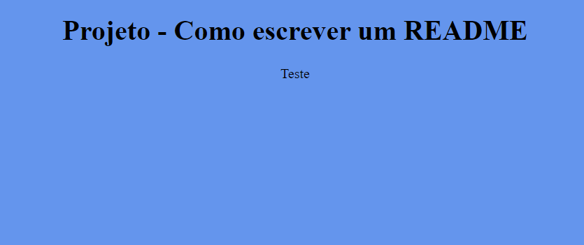

# Índice

[Projeto de portfólio pessoal](#projeto-de-portf%C3%B3lio-pessoal)  
[Descrição](#descri%C3%A7%C3%A3o)  
[Introdução](#introdu%C3%A7%C3%A3o)  
[Funcionalidades](#funcionalidades)  
[Tecnologias utilizadas](#tecnologias-utilizadas)  
[Fontes consultadas](#fontes-consultadas)  
[Autores](#autores)  

# Projeto - Como escrever um README file

## Descrição

## Introdução

## Funcionalidades 

### Tecnologias utilizadas

## Fontes consultadas

## Autores
